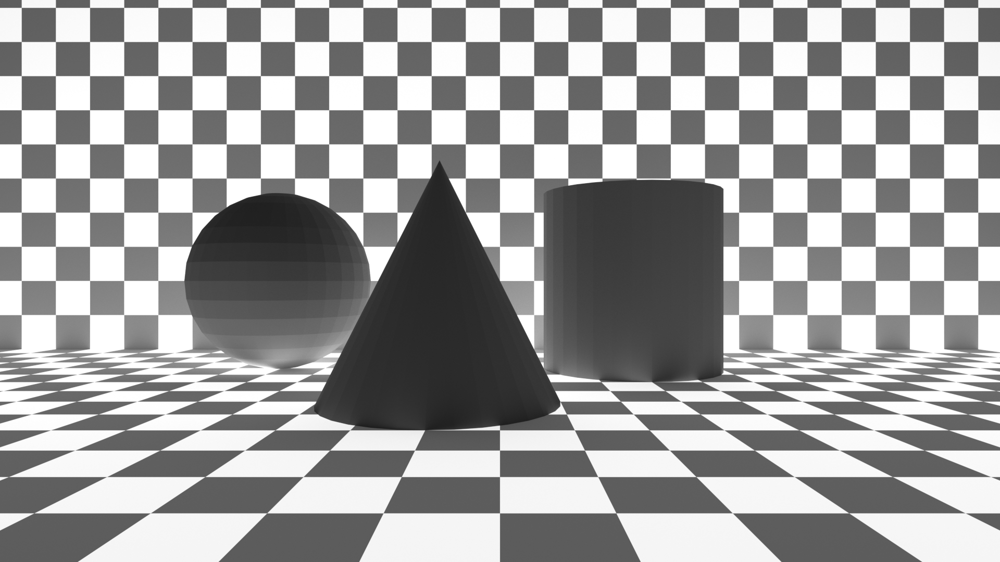
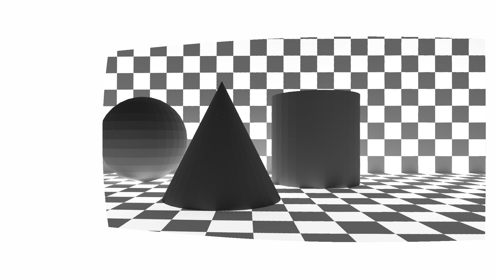

Distortion correction using UV maps generated from blender and opencv.

This should be an accurate way to correct distortion as blender's cycles renderer is physically based.

The UV map is in openexr format as other formats are not quite accurate enough for inverse mapping. PNG causes some fuzzy artifacts.

As a result of the refraction, the effective interocular distance is a bit smaller than it physically is.

All of the code here was generated using ChatGPT.

The current position and orientation of the camera is not yet final. As such, the DistortedUV.exr provided here is a proof of concept.

The sample images provided are from the right camera.

The reconstructed image is comparatively quite cropped in compared to the undistorted one.

**Undistorted Ground Truth**  

**Reconstructed from Distorted**  
